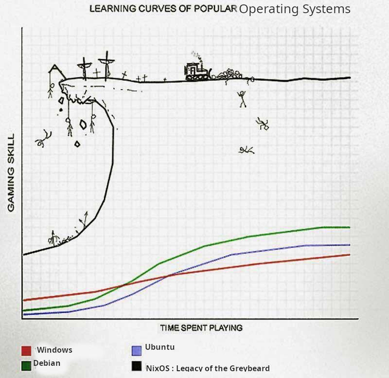

## Nix Workshop for Systems Research

</img>

**Slides:** https://github.com/Mic92/nix-workshop

Note:
- We use Nix in the group since 2019
- 2022: Good time for Nix workshop :)

## What are talking about today

- What is Nix?
- How can use it for your research at our chair?
  - to make it easier to work in a team
  - to produce reproducible research


## Nix taxonomy

</img>


## Why nix

- Central & declarative configuration our all of our servers:
- Each user or project can have their own packages (less overhead than containers)
- Flexible: 
  - existing packages can be overwritten with patches 
  - cross-compiled to other architectures
  - easy to apply kernel patches
- [Biggest most up-to-date Package manager](https://repology.org/graph/map_repo_size_fresh.svg)
- [7th most active repository by contributors in 2022 on github](https://octoverse.github.com/2022/state-of-open-source)


## Why not nix

</img>

<center>Hopefully we can fix this in this talk :)</center>


## How does nix work? (1/2)

- Each package gets its own unique installation path:
- `/nix/store/rpdqx...-firefox-3.5.4`
- Path contains a sha1 hash over all its build instructions and build and
  runtime dependencies
- Consequences: 
  - Install different versions of the same package without conflicts
  - Atomic upgrades
  - Rollbacks

Note:
  - Atomic upgrades : Install new version while keeping the old ones
  - Rollbacks: rollback to old package if the new one does not work -> Each nixos upgrades gets a grub boot entry


## How does nix work? (2/2)

Identical libraries are shared between packages:

```
/nix/store 
|-- l9w6773m1msy...-openssh-4.6p1
|  |-- bin
|  |  |-- ssh
|  |-- sbin
|     |-- sshd
|-- smkabrbibqv7...-openssl-0.9.8e
|  |-- lib
|     |-- libssl.so.0.9.8
|-- c6jbqm2mc0a7...-zlib-1.2.3
|  |-- lib
|     |-- libz.so.1.2.3
|-- im276akmsrhv...-glibc-2.5
   |-- lib
      |-- libc.so.6
```


## How to setup a project with Nix

- In a project initialize our [template](https://github.com/TUM-DSE/doctor-cluster-config/tree/master/templates)

```console
$ nix flake init --template github:TUM-DSE/doctor-cluster-config#project
```

Instead of globally installing all dependencies in they system, we have two
files in our project repository:

- **flake.nix**: describes all build tools needed to 
- **flake.lock**: locks down the dependency versions so that we can reproduce the exact version


## How to setup a project with Nix

- To load a shell:

```console
$ gcc --version
bash: command not found: gcc
$ nix develop
nix-shell> gcc --version
gcc (GCC) 10.4.0
```


## Find packages you want

- [nixpkgs package search](https://search.nixos.org/packages)
- [nixos option search](https://search.nixos.org/options?)
- [nix-index](https://github.com/bennofs/nix-index):

```console
$ nix-locate include/zlib.h
zlib.dev                                         97,317 r /nix/store/smfnf8ayl3473bqlhwizl9r18rphydjp-zlib-1.2.12-dev/include/zlib.h
...
```


## The Nix Language

- Nix language is like "JSON" with functions:
  - [Data structures](https://nix.dev/tutorials/nix-language#attribute-set): 
    - numbers / strings / booleans / list / maps (called attrsets)
  - Functions
  - Variable assignments:
 
 ```
    let
       somevar = 1;
    in ...
 ```
- [Language tutorial](https://nix.dev/tutorials/nix-language)


## Home-manager

- [Home-manager](https://github.com/nix-community/home-manager) manages programs of your users (i.e. editor, shell commands...) and more!
- Initialize our [home-manager template](https://github.com/TUM-DSE/doctor-cluster-config/tree/master/templates) and follow the instructions in there

- You can more home-manager options here: https://mipmip.github.io/home-manager-option-search/


## NixOS

- NixOS uses a configuration based on the nix language called the module system:

```
{ pkgs, ... }:
{ 
  services.openssh.enable = true;
  environment.systemPackages = [ pkgs.vim ];
  # Advanced stuff
  boot.kernelPatches = [{
    name = "daxfs-config";
    patch = null;
    extraConfig = "FS_DAX y";
  }];
}
```


## NixOS in our chair

- [The NixOS configuration of our hosts](https://github.com/TUM-DSE/doctor-cluster-config)
- central user management (self-service)
- easy to move services between machines
- 17 machines in TUM on 3 architecture:
  - x86_64-linux
  - aarch64-linux
  - aarch64-darwin (no nixos)
  - riscv64-linux (cross-compiled!)
- Each PR get automatically build in our [CI](https://buildbot.dse.in.tum.de/)
- Machines fetch artifacts from our [binary cache](https://tum-dse.cachix.org/)


## Conclusion

- Nix is very powerful & flexible but has a learning curve
- We learned:
  - Setting up reproducible development enviroments
  - How to find packages
  - Manage your own user enviroment with home-manager
  - Where to find our nixos configuration
