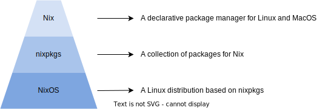

## Nix Workshop for Systems Research

</img>

**Slides:** https://github.com/Mic92/nix-workshop


## What are talking about today

- What is Nix?
- How can use it for your research at our chair?
  - to make it easier to work in a team
  - to produce reproducible research


## Nix taxonomy

</img>


## Why nix

- Central & declarative configuration our all of our servers:
- Each user or project can have their own packages (less overhead than containers)
- Flexible: 
  - existing packages can be overwritten with patches 
  - cross-compiled to other architectures
  - easy to apply kernel patches
- [Biggest most up-to-date Package manager](https://repology.org/graph/map_repo_size_fresh.svg)
- [7th most active repository by contributors in 2022 on github](https://octoverse.github.com/2022/state-of-open-source)


## How does nix work? (part 1)

- Each package gets its own unique installation path:
- `/nix/store/rpdqx...-firefox-3.5.4`
- Path contains a sha1 hash over all its build instructions and build and
  runtime dependencies
- Consequences: 
  - Install different versions of the same package without conflicts
  - Atomic upgrades
  - Rollbacks

Notes:
  - Atomic upgrades : Install new version while keeping the old ones
  - Rollbacks: rollback to old package if the new one does not work -> Each nixos upgrades gets a grub boot entry

## How does nix work? (part 2)

Identical libraries are shared between packages:

```
/nix/store 
|-- l9w6773m1msy...-openssh-4.6p1
|  |-- bin
|  |  |-- ssh
|  |-- sbin
|     |-- sshd
|-- smkabrbibqv7...-openssl-0.9.8e
|  |-- lib
|     |-- libssl.so.0.9.8
|-- c6jbqm2mc0a7...-zlib-1.2.3
|  |-- lib
|     |-- libz.so.1.2.3
|-- im276akmsrhv...-glibc-2.5
   |-- lib
      |-- libc.so.6
```


## Nix development shell example

See our [template](https://github.com/TUM-DSE/doctor-cluster-config/tree/master/templates)


## Pinning revision


## Language tutorials

- Nix is like "JSON" with functions

- [Language tutorial](https://nix.dev/tutorials/nix-language)


## Find packages by name and by file

- nix package search
- nixos option search
- nix-locate


## Home-manager


## NixOS in our chair

- show configuration repo
- show CI
